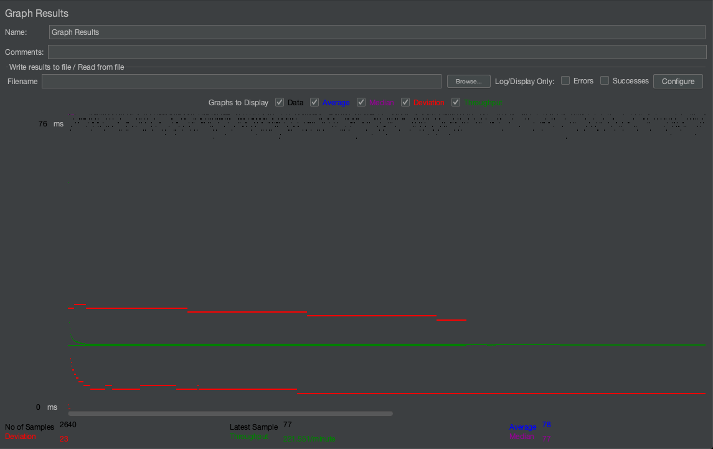
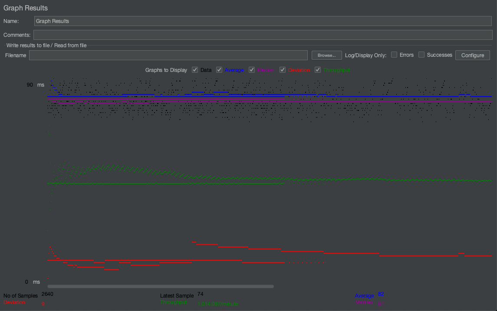
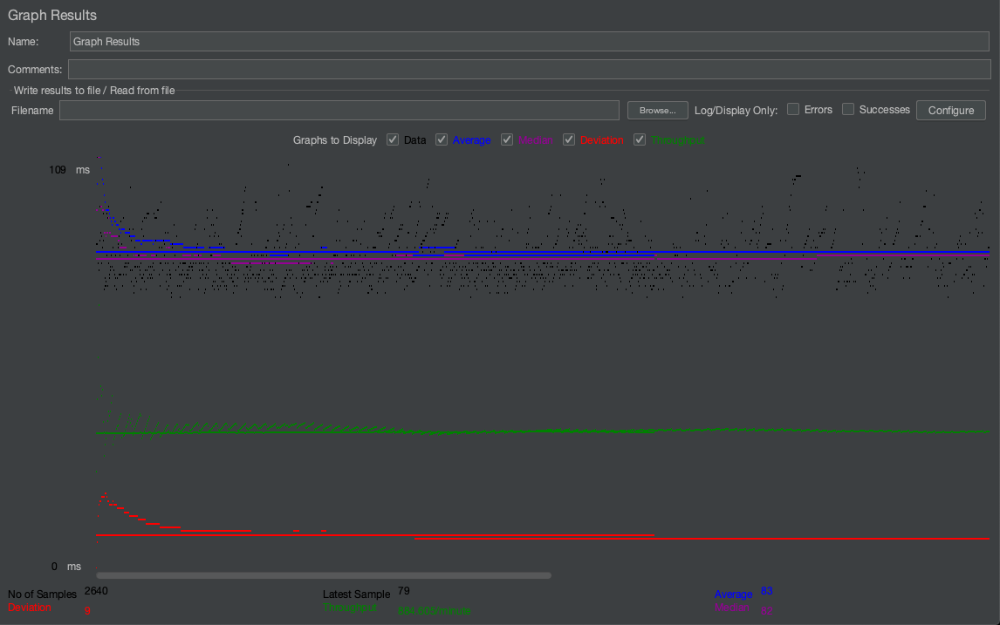
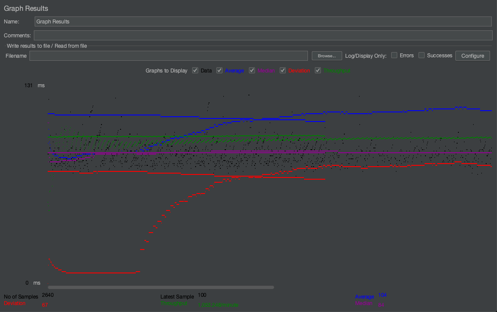
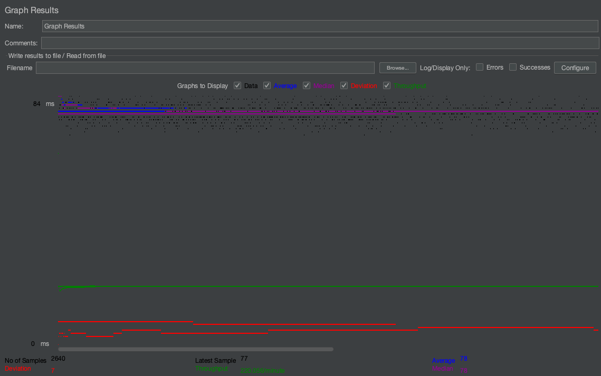
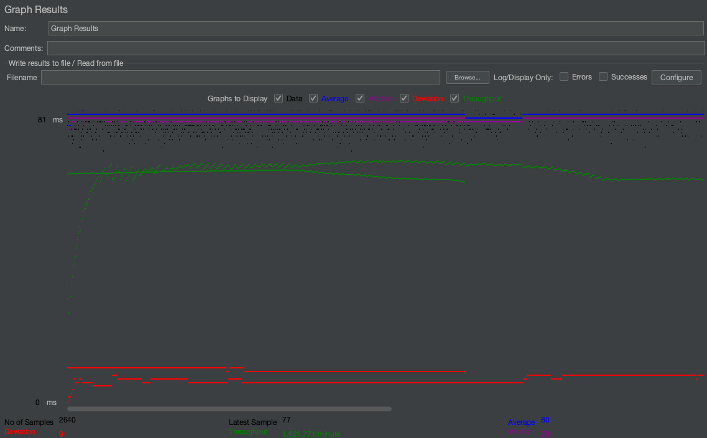
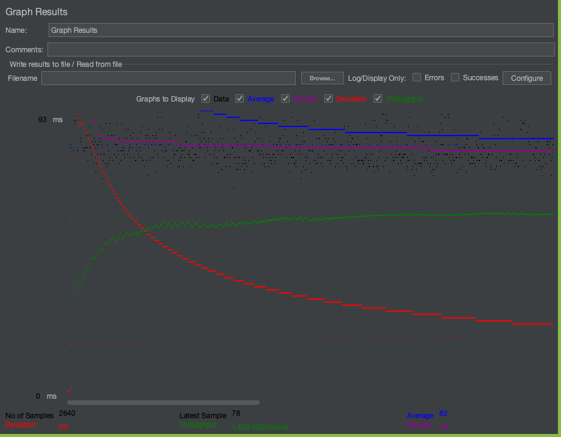

# cs122b-spring21-team-50

PROJECT 5 README.md TEMPLATE

  # NOTE: in log files for each test case, the left column contains the ts readings and the right column contains the tj readings.

- # General
    - #### Team#: 50
    
    - #### Names: Vince Cerda, Michelle Chen
    
    - #### Project 5 Video Demo Link: https://youtu.be/Oc5ESj1j4AU

    - #### Instruction of deployment: 
        Fabflix Webapp:
          - Inside the repo, cd into fabflix and build the war file by running `mvn clean package`.
          - Run `sudo cp ./target/*.war /var/lib/tomcat9/webapps/` to copy the build war file into the tomcat server for deployment
          - Open tomcat manager and click on the webapp called `cs122b-spring21-team-50`
          - The link will bring you to this URL [https://18.216.38.168:8443/cs122b-spring21-team-50/](  https://18.216.38.168:8443/cs122b-spring21-team-50/)

        Fabflix Android App:
          - Using Android Studio, open the project fabflixmobile from the repo. Run the project. Wait for the Android emulator
            to finish initializing and run the app.

        Fabflix Scaled
          - Master Instance on AWS:
              - ssh into the master instance in AWS 
              - Inside the repo, cd into fabflix and build the war file by running mvn clean package.
              - Run sudo cp ./target/*.war /var/lib/tomcat9/webapps/ to copy the build war file into the tomcat server for deployment
          - Slave Instance on AWS:
              - ssh into the slave instance in AWS 
              - Inside the repo, cd into fabflix_slave and build the war file by running man clean package.
              - Run sudo cp ./target/*.war /var/lib/tomcat9/webapss/ to copy the build war file into the tomcat server for deployment
          - AWS and GCP load balancer:
              - Set up Apache 2 and change default config in /etc/apache2/sites-enabled/000-default.conf

    - #### Collaborations and Work Distribution:
        Vince Cerda:
          - Task 1
          - Task 3
          - Task 4.1
          - Task 4: made jmeter jmx files for test cases 1, 2, and 3 for the scaled version of fabflix

        Michelle Chen:
          - Task 2
          - Task 4: made jmeter jmx files for test cases 1, 2, 3, and 4 for the single version of fabflix
          - README.md

- # Connection Pooling
    - #### Include the filename/path of all code/configuration files in GitHub of using JDBC Connection Pooling.

      - fabflix single version and fabflix master instance use the same version of the code:
      fabflix/src/main/java/main/java/BrowseServlet.java
      fabflix/src/main/java/main/java/DashboardActionServlet.java
      fabflix/src/main/java/main/java/DashboardMetadataServlet.java
      fabflix/src/main/java/main/java/DashboardServlet.java
      fabflix/src/main/java/main/java/LoginServlet.java
      fabflix/src/main/java/main/java/MovieServlet.java
      fabflix/src/main/java/main/java/Payments.java
      fabflix/src/main/java/main/java/SingleMovieServlet.java
      fabflix/src/main/java/main/java/SingleStarServlet.java
      fabflix/src/main/java/main/java/TitleSuggestion.java
      fabflix/web/META-INF/context.xml

      - fabflix slave instance uses a different version of context.xml which has 2 resources and each servlet uses
        a specific type of resource
      fabflix_slave/src/main/java/main/java/BrowseServlet.java
      fabflix_slave/src/main/java/main/java/DashboardActionServlet.java
      fabflix_slave/src/main/java/main/java/DashboardMetadataServlet.java
      fabflix_slave/src/main/java/main/java/DashboardServlet.java
      fabflix_slave/src/main/java/main/java/LoginServlet.java
      fabflix_slave/src/main/java/main/java/MovieServlet.java
      fabflix_slave/src/main/java/main/java/Payments.java
      fabflix_slave/src/main/java/main/java/SingleMovieServlet.java
      fabflix_slave/src/main/java/main/java/SingleStarServlet.java
      fabflix_slave/src/main/java/main/java/TitleSuggestion.java
      fabflix_slave/web/META-INF/context.xml
    
    - #### Explain how Connection Pooling is utilized in the Fabflix code.
        - To utilize connection pooling in Fabflix, we first created a new user with the flag `IDENTIFIED WITH mysql_native_password BY <password>`
        - We added two lines 
              `factory="org.apache.tomcat.jdbc.pool.DataSourceFactory"`
              `maxTotal="100" maxIdle="30" maxWaitMillis="10000"` 
          into our context.xml under Resource tag which stores our database connection information. 
          By adding these line in the Resource tag, we are explicitly making the connection cached such that threads can reuse the database connections. 
        - We have to also edit the url attribute in the Resource tag by adding parameters `?autoReconnect=true&amp;sslMode=DISABLE&amp;cachePrepStmts=“true”`
        - Our code utilizes connection pooling by first checking if a connection is available from the pool (size is determined by the maxTotal parameter passed in our context.xml resource). 
          If there is a connection available, our servlets will use that connection, and after performing what it needs to, it will put the connection back in the pool.
          If there isn't one availbale in the pool, our servlets will wait till a connection is freed. By reusing connections like this, we effectively make our codebase more efficient.
    
    - #### Explain how Connection Pooling works with two backend SQL.
        - For two backend MySQL, there will be a set of connection pools for each MySQL. With two backend SQL, there will be two connection pools
          created (default 100 connections each pool as specified by context.xml resource). The load balancer would determine which server to route a user which in turn determines which 
          pool that user will use. In this stage, the servlets of each server will perform the same actions as the single version servlets described above.
    

- # Master/Slave
    - #### Include the filename/path of all code/configuration files in GitHub of routing queries to Master/Slave SQL.

        - code and configuration files used for fabflix master instance (same as fabflix single instance)
        fabflix/src/main/java/main/java/BrowseServlet.java
        fabflix/src/main/java/main/java/DashboardActionServlet.java
        fabflix/src/main/java/main/java/DashboardMetadataServlet.java
        fabflix/src/main/java/main/java/DashboardServlet.java
        fabflix/src/main/java/main/java/LoginServlet.java
        fabflix/src/main/java/main/java/MovieServlet.java
        fabflix/src/main/java/main/java/Payments.java
        fabflix/src/main/java/main/java/SingleMovieServlet.java
        fabflix/src/main/java/main/java/SingleStarServlet.java
        fabflix/src/main/java/main/java/TitleSuggestion.java
        fabflix/web/META-INF/context.xml

        - code and configuration files used for fabflix slave instance
        fabflix_slave/src/main/java/main/java/BrowseServlet.java
        fabflix_slave/src/main/java/main/java/DashboardActionServlet.java
        fabflix_slave/src/main/java/main/java/DashboardMetadataServlet.java
        fabflix_slave/src/main/java/main/java/DashboardServlet.java
        fabflix_slave/src/main/java/main/java/LoginServlet.java
        fabflix_slave/src/main/java/main/java/MovieServlet.java
        fabflix_slave/src/main/java/main/java/Payments.java
        fabflix_slave/src/main/java/main/java/SingleMovieServlet.java
        fabflix_slave/src/main/java/main/java/SingleStarServlet.java
        fabflix_slave/src/main/java/main/java/TitleSuggestion.java
        fabflix_slave/web/META-INF/context.xml

    - #### How read/write requests were routed to Master/Slave SQL?
        The main component that does the heavy lifting is the context.xml file in the slave instance. In this context.xml 
        file, there are two resources. One resource points to the database of the slave instance. This resource is for 
        reading. Another resource in the slave instance's context.xml file points to master's database. This resource is
        for writing. In our fabflix slave codebase, only two servlets use the resource for writing. Those two are 
        DashboardActionServlet.java and Payments.java, whose sql queries are routed to master's database for processing.
        The rest of the servlets do reads, which can be performed by the slave instance itself.

        On the master instance, there is only one resource that points to the master instance's database. The reason for
        this is because master can perform both reads and writes and there is no need to reroute the reads/writes of any
        servlets in this instance to another database source.

        The splitting of reads between master and slave is handled by the load balancer, who takes care of splitting the
        traffic in half, which should in turn split the reads between master and slave.
    

- # JMeter TS/TJ Time Logs
    - #### Instructions of how to use the `log_processing.*` script to process the JMeter logs.
      - For Single Instance case logs:
          - Run python3 log_processing.py <path to mainLogs.txt>
          - This should output the average search servlet time and the average jdbc time for each test case
      - For Scaled-version case logs:
          - Run python3 log_processing.py <path to masterLogs.txt> <path to slaveLogs.txt>
          - This should output the average search servlet time and the average jdbc time for each test case

- # JMeter TS/TJ Time Measurement Report

| **Single-instance Version Test Plan**          | **Graph Results Screenshot** | **Average Query Time(ms)** | **Average Search Servlet Time(ms)** | **Average JDBC Time(ms)** | **Analysis** |
|------------------------------------------------|------------------------------|----------------------------|-------------------------------------|---------------------------|--------------|
| Case 1: HTTP/1 thread                          |    | 78                         | 1.61                                  | 1.39                        | This is expected because there is only one user serving as traffic.           |
| Case 2: HTTP/10 threads                        |    | 82                         | 2.81                                  | 2.57                        | These times are slightly higher than 1 thread because now, 10 threads (or 10 users being simulated) are serving as traffic.           |
| Case 3: HTTPS/10 threads                       |    | 83                         | 3.13                                  | 2.75                        | HTTPS is generally slower than HTTP which is why this test case is slightly slower than test case 2 (similar test layout).          |
| Case 4: HTTP/10 threads/No connection pooling  |    | 104                        | 24.64                                 | 2.60                        | Average jdbc time is consistent with the other test cases because they use the same sql query structure. The average search servlet time, though, is drastically different because with no connection pooling, the servlets have to establish a connection which is slower because it requires more steps (open connection, use connection, close connection).           |

| **Scaled Version Test Plan**                   | **Graph Results Screenshot** | **Average Query Time(ms)** | **Average Search Servlet Time(ms)** | **Average JDBC Time(ms)** | **Analysis** |
|------------------------------------------------|------------------------------|----------------------------|-------------------------------------|---------------------------|--------------|
| Case 1: HTTP/1 thread                          |    | 78                         | 1.89                                  | 1.53                        | Similar to the results from the single-instance tests, these numbers are expected since there is only one user serving as traffic. This though, is slightly faster than single-instance, which is expected since it is using load balancing.           |
| Case 2: HTTP/10 threads                        |    | 80                         | 2.11                                  | 1.90                        | Similar to the results from the single-instance tests, these numbers are slightly higher than 1 thread because there are 10 threads serving as traffic. These though, are slightly faster than single-instance, which is expected since it is using load balancing.           |
| Case 3: HTTP/10 threads/No connection pooling  |    | 82                         | 4.34                                  | 2.53                        | The time given for TJ is very similar to single-instance test case 4. The TS time, however is drastically smaller due to the fact that it is using load balancing, which means that there is less traffic to cause more connections to be demanded in each server.           |